# Teach & Learn Platform  
**A Traditional Laravel 5.6 Learning & Community Platform (Built in 2019)**  
**Laravel 5.6 • Blade • Bootstrap**

---

## About the Project
**Teach & Learn** is a hybrid **LMS + community platform** built in **2019** using **Laravel 5.6** with a traditional Blade-based architecture.  
Users can interact through courses, exams, posts, Q&A, tagging, and more.

Users have two roles: **Teacher** or **Student**, each with specific capabilities, creating a complete learning ecosystem.

---

## Key Features

###  User Roles & Permissions
#### Teacher Capabilities
- Create and manage courses  
- Upload educational videos  
- Create and conduct online exams  

#### Student Capabilities
- Browse courses  
- Enroll in courses  
- Take online exams  
- View results  

---

### Courses Module
- Teachers can create courses  
- Students can enroll  
- Course **rating system**  
- **Tagging support**  
- Uploading lecture **videos**

| 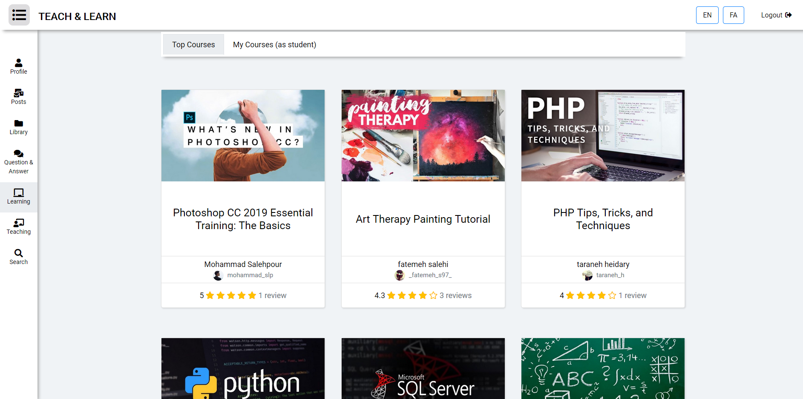 | 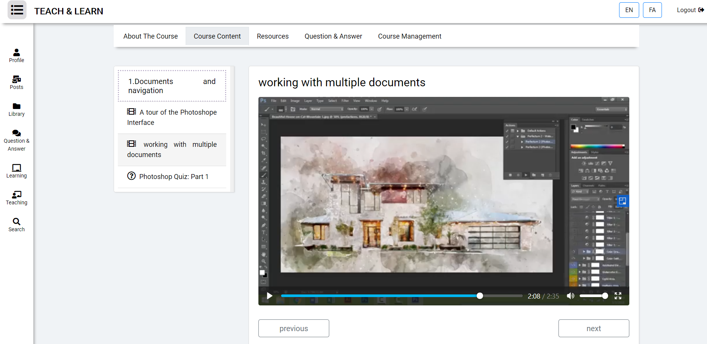 |
| --- | --- |
| 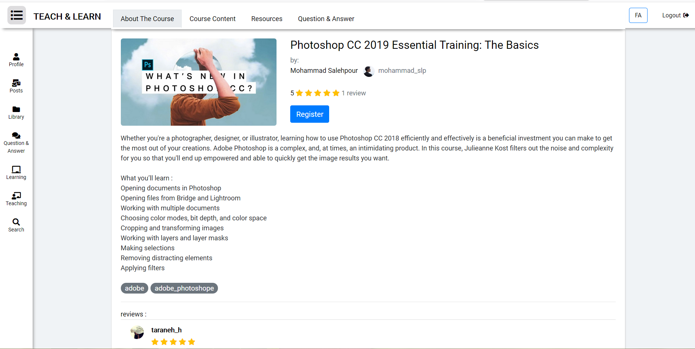 | 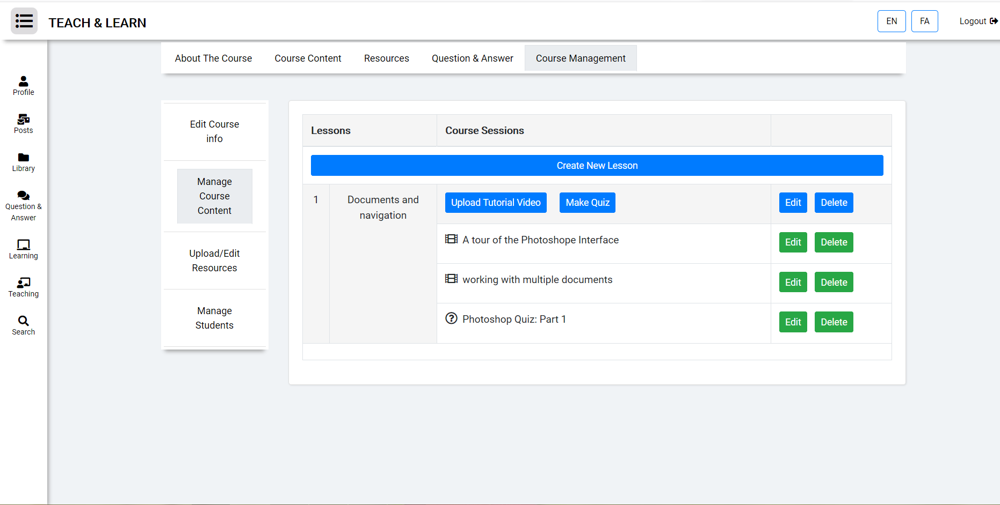 |

---

### Online Exam System
- Exams created by teachers  
- Students submit answers  
- View exam results  
- Full exam management panel for teachers  

| 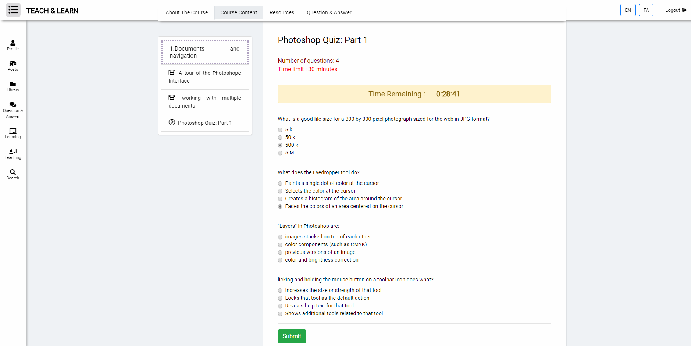 | 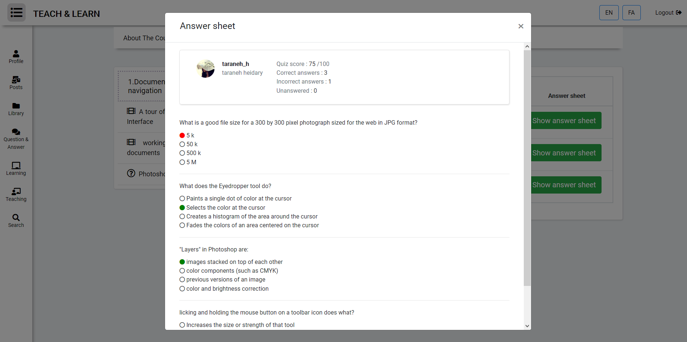 |
| --- | --- |

---

### Q&A Section (Community-Based)
A StackOverflow-like environment:

- Users can ask questions  
- Others can answer  
- **Upvote/downvote** answers  
- Tagging system  

| 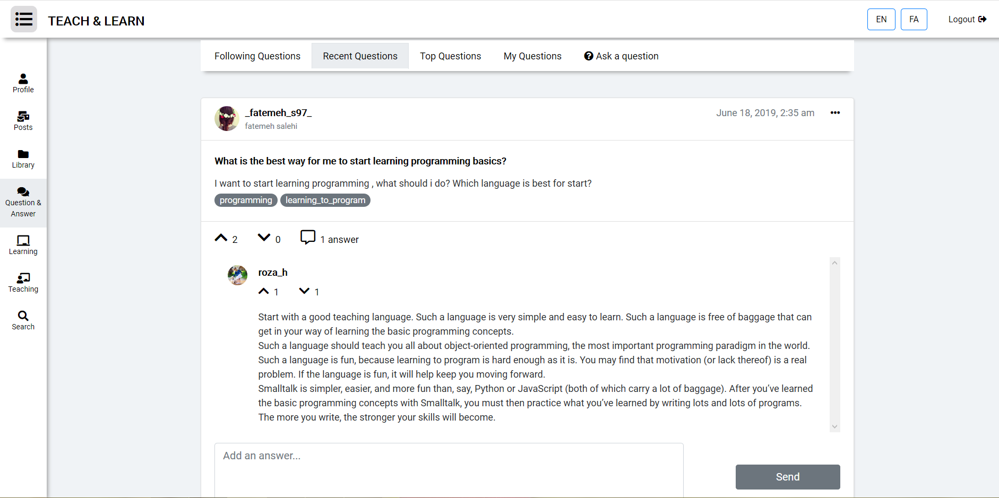 |
| --- |

---

### User Profiles
Each user has a complete profile including:

- Avatar  
- Personal information  
- Enrolled courses  
- Posts
- Questions 

| 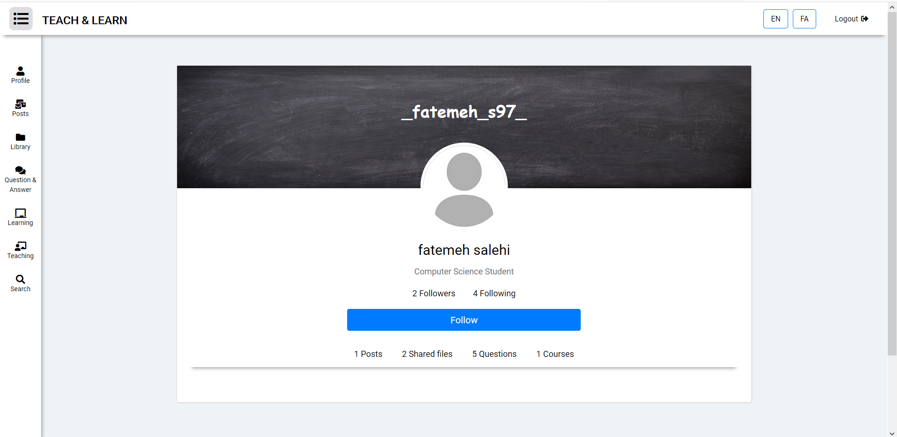 | 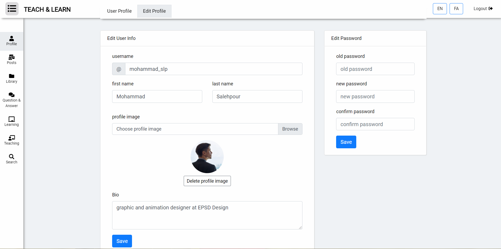 |
| --- | --- |

---

### Social Posts & Interactions
A lightweight internal social network:

- Users can create posts  
- Others can like & comment  
- Posts support tagging  
- Filter/search posts by tags  

| 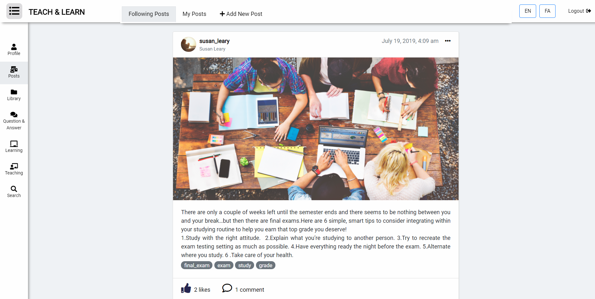 | 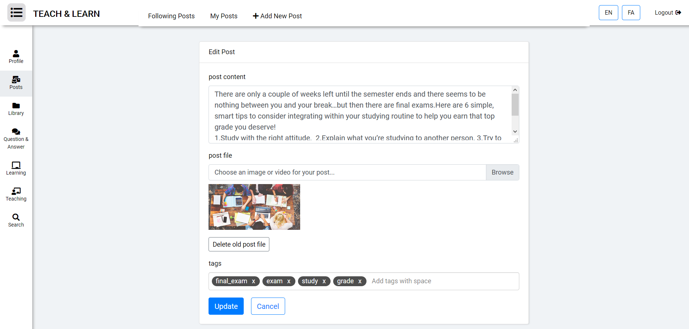 |
| --- | --- |

---

### Unified Tagging System
Tags are used across the entire platform:

- Courses  
- Posts  
- Questions  

This provides consistent and powerful content classification.

---

## Tech Stack

| Component | Technology |
|----------|------------|
| Backend | **Laravel 5.6** |
| Frontend | **Blade**, **Bootstrap 4** |
| Database | MySQL |
| Authentication | Laravel Auth |
| Media Handling | Local Storage |
| Build Year | **2019** |
---

